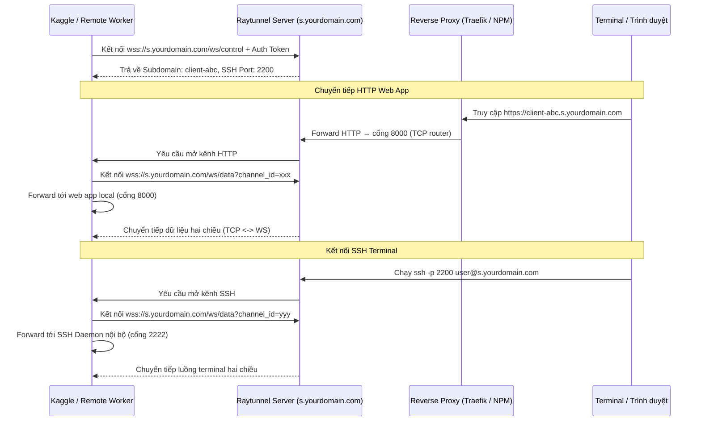

# Raytunnel 🚀

Raytunnel là một giải pháp reverse tunnel (HTTP và SSH forwarding) siêu nhẹ, bảo mật và được thiết kế tối giản nhằm thay thế cho Gradio/Ngrok. Thích hợp nhất cho việc tương tác giữa máy cá nhân và các remote instance (Kaggle, Colab, Cloud Server) kết nối trực tiếp về hệ thống Homelab.

---

## 🌟 Tính năng nổi bật

- **Tối giản & Tự chủ**: Hoạt động hoàn toàn trong user-space, không cần cấu hình tài khoản Unix hay SSH keys phức tạp trên Host OS của server.
- **Tự động cấu hình SSH Daemon**: Client tự phát hiện, cấu hình và khởi chạy SSH Daemon (`sshd`) ở cổng 2222, tạo cặp khóa SSH động giúp bạn SSH trực tiếp vào remote instance (ví dụ: Kaggle) cực kỳ tiện lợi.
- **Dynamic HTTP Host Routing**: Tự động phân tích trường `Host` trong HTTP request để điều hướng tới đúng client đăng ký (ví dụ: `my-worker.s.yourdomain.com`).
- **Thân thiện với Notebook**: Có sẵn API bất đồng bộ chạy ngầm (`background=True`) để bạn gọi trực tiếp trong cell của Jupyter/Kaggle notebook mà không làm nghẽn luồng xử lý chính.
- **Bảo mật tuyệt đối**:
  - Xác thực kết nối điều khiển bằng Token bí mật.
  - SSH daemon được cấu hình chỉ nhận khóa public key, cấm đăng nhập bằng mật khẩu (`PasswordAuthentication no`).

---

## 📐 Kiến trúc hoạt động



### Phân vai các cổng

| Cổng | Mục đích |
|------|----------|
| `8001` | FastAPI API + WebSocket control (`/ws/control`, `/ws/data`) + Dashboard |
| `8000` | TCP raw proxy — đọc Host header và route HTTP traffic đến đúng client |
| `2200-2300` | Dải cổng SSH động được server cấp phát cho từng tunnel |

> [!IMPORTANT]
> Reverse proxy cần **2 route riêng biệt**: `s.yourdomain.com` → cổng **8001** (control WebSocket + Dashboard), `*.s.yourdomain.com` → cổng **8000** (HTTP tunnel traffic). Nếu route tất cả về 8000, client sẽ gặp lỗi `HTTP 404` khi kết nối WebSocket control.

---

## 📦 Cấu trúc dự án

```
raytunnel/
├── src/                        # Source code Python
├── Dockerfile                  # Docker image definition
├── compose.yaml                # Docker Compose config
├── example-env                 # Template file biến môi trường
├── raytunnel-server.service    # Systemd service file
├── pyproject.toml
└── README.md
```

---

## 📥 Cài đặt

### Cài từ PyPI (khuyên dùng)

```bash
pip install raytunnel
```

### Cài từ source (GitHub)

```bash
pip install git+https://github.com/mrtruongleo/raytunnel.git
```

### Cài ở chế độ editable (phát triển local)

```bash
git clone https://github.com/mrtruongleo/raytunnel.git
cd raytunnel
uv pip install -e .
```

---

## 🛠 Hướng dẫn Cấu hình & Triển khai

### 1. Triển khai Server (Trên Proxmox Container / VPS)

Bạn có ba cách để chạy server:

#### Cách A: Chạy trực tiếp qua Systemd Service (Khuyên dùng)

1. Cài đặt package `raytunnel` trên container:
   ```bash
   pip install git+https://github.com/mrtruongleo/raytunnel.git
   ```
2. Copy file `raytunnel-server.service` vào `/etc/systemd/system/`:
   ```bash
   cp raytunnel-server.service /etc/systemd/system/
   ```
3. Chỉnh sửa dòng `ExecStart` trong file service — thêm token và domain thực:
   ```ini
   ExecStart=/usr/local/bin/raytunnel server --host 0.0.0.0 --port 8001 --tcp-port 8000 --token your_very_strong_token --domain s.yourdomain.com
   ```
4. Kích hoạt và chạy dịch vụ:
   ```bash
   sudo systemctl daemon-reload
   sudo systemctl enable --now raytunnel-server
   sudo systemctl status raytunnel-server
   ```

#### Cách B: Chạy qua Docker Compose

1. Copy file cấu hình môi trường:
   ```bash
   cp example-env .env
   ```
2. Chỉnh sửa `.env` với token và domain thực của bạn:
   ```env
   RAYTUNNEL_TOKEN=your_very_strong_token
   DOMAIN=s.yourdomain.com
   ```
3. Build và chạy từ thư mục gốc của project:
   ```bash
   docker compose up -d --build
   ```

Verify sau khi start:
```bash
docker logs raytunnel-server --tail 20
curl http://localhost:8001   # → Dashboard hiện "No active tunnels"
```

> [!WARNING]
> **Không dùng shell variable** `${RAYTUNNEL_TOKEN:-default}` trong compose.yaml nếu bạn không set env trước khi chạy — sẽ dùng giá trị `default` thay vì token thực. Luôn dùng file `.env` hoặc hardcode trực tiếp.

#### Cách C: Chạy qua Docker CLI trực tiếp

```bash
docker build -t raytunnel-server .
docker run -d --name raytunnel \
  -p 8000:8000 -p 8001:8001 -p 2200-2300:2200-2300 \
  -e RAYTUNNEL_TOKEN="your_very_strong_token" \
  -e DOMAIN="s.yourdomain.com" \
  raytunnel-server
```

---

### 2. Cấu hình DNS & Reverse Proxy

#### 2.1 DNS trên Cloudflare

Tạo 2 bản ghi CNAME (hoặc A) trỏ về IP public của homelab:

| Type | Name | Target | Proxy |
|------|------|--------|-------|
| `CNAME` | `s` | `ip.yourdomain.com` | Proxied ☁️ |
| `CNAME` | `*.s` | `ip.yourdomain.com` | **DNS only** 🔘 |

> [!WARNING]
> Cloudflare **Free plan không hỗ trợ Proxied wildcard** — bắt buộc để `*.s` là **DNS only** (grey cloud). Verify bằng: `dig rvc.s.yourdomain.com @1.1.1.1 +short`

#### 2.2 Port Forwarding trên Router

| External Port | Internal IP | Internal Port | Protocol |
|--------------|-------------|---------------|----------|
| `443` | IP của reverse proxy | `443` | TCP |
| `2200-2300` | IP của raytunnel server | `2200-2300` | TCP |

> [!NOTE]
> Cổng `2200-2300` chỉ thực sự listen sau khi có client kết nối. `Connection refused` trên cổng này là bình thường khi chưa có tunnel nào hoạt động.

---

#### 2.3 Cấu hình Traefik (Nếu bạn dùng Traefik)

Thêm service raytunnel vào Traefik bằng cách tạo một file config động trong thư mục dynamic config của Traefik (ví dụ: `./external/raytunnel.yaml`):

```yaml
http:
  routers:
    # Control plane: WebSocket /ws/control + Dashboard — cổng 8001 (FastAPI)
    raytunnel-control:
      rule: "Host(`s.yourdomain.com`)"
      entryPoints:
        - websecure
      service: raytunnel-api
      tls:
        certResolver: production

    # Tunnel traffic: worker.s.yourdomain.com — cổng 8000 (TCP router)
    raytunnel-tunnel:
      rule: "HostRegexp(`{subdomain:[a-z0-9-]+}.s.yourdomain.com`)"
      entryPoints:
        - websecure
      service: raytunnel-tcp
      tls:
        certResolver: production

  services:
    raytunnel-api:
      loadBalancer:
        servers:
          - url: "http://<IP_RAYTUNNEL_SERVER>:8001"   # Control/WS API

    raytunnel-tcp:
      loadBalancer:
        servers:
          - url: "http://<IP_RAYTUNNEL_SERVER>:8000"   # HTTP tunnel routing
```

> [!NOTE]
> Thay `<IP_RAYTUNNEL_SERVER>` bằng IP thực của container/VPS đang chạy raytunnel server. Đảm bảo thư mục dynamic config của Traefik đang được watch (thường cấu hình qua `providers.file.directory` trong `traefik.yaml`).

---

#### 2.4 Cấu hình Nginx Proxy Manager (Nếu bạn dùng NPM)

Nginx Proxy Manager cần **2 Proxy Host** riêng biệt. Cả hai đều cần bật **SSL với Let's Encrypt**.

##### Proxy Host 1 — Control Plane (`s.yourdomain.com`)

Vào **Proxy Hosts → Add Proxy Host**, điền như sau:

| Trường | Giá trị |
|--------|---------|
| Domain Names | `s.yourdomain.com` |
| Scheme | `http` |
| Forward Hostname/IP | `<IP_RAYTUNNEL_SERVER>` |
| Forward Port | `8001` |
| Websockets Support | ✅ Bật |
| Block Common Exploits | ✅ Bật |

Tab **SSL**: Chọn **Request a new SSL Certificate**, bật **Force SSL** và **HTTP/2 Support**.

##### Proxy Host 2 — Tunnel Traffic (`*.s.yourdomain.com`)

Vào **Proxy Hosts → Add Proxy Host**, điền như sau:

| Trường | Giá trị |
|--------|---------|
| Domain Names | `*.s.yourdomain.com` |
| Scheme | `http` |
| Forward Hostname/IP | `<IP_RAYTUNNEL_SERVER>` |
| Forward Port | `8000` |
| Websockets Support | ✅ Bật |
| Block Common Exploits | ✅ Bật |

Tab **SSL**: Chọn **Request a new SSL Certificate** — NPM sẽ issue wildcard cert qua DNS Challenge.

> [!IMPORTANT]
> **Wildcard SSL (`*.s.yourdomain.com`) bắt buộc phải dùng DNS Challenge** (HTTP Challenge không hỗ trợ wildcard). Trong NPM, tab SSL → chọn DNS Challenge provider (ví dụ Cloudflare) → nhập API Token Cloudflare có quyền `Zone:DNS:Edit`.

> [!WARNING]
> NPM không thực hiện routing theo subdomain ở tầng ứng dụng — toàn bộ `*.s.yourdomain.com` được forward thẳng về cổng `8000` của raytunnel server, và **raytunnel server tự xử lý routing** dựa vào `Host` header. Đây là hành vi đúng và mong muốn.

Tab **Advanced** của Proxy Host 2, thêm custom Nginx config để đảm bảo `Host` header được truyền đúng:

```nginx
proxy_set_header Host $host;
proxy_set_header X-Real-IP $remote_addr;
proxy_set_header X-Forwarded-For $proxy_add_x_forwarded_for;
proxy_set_header X-Forwarded-Proto $scheme;
```

---

### 3. Cài đặt & Sử dụng Client (Trên Kaggle / Colab / Máy trạm)

```bash
# Cài đặt qua pip từ Git (môi trường remote)
pip install git+https://github.com/mrtruongleo/raytunnel.git

# Hoặc cài đặt ở chế độ editable (phát triển local)
uv pip install -e /path/to/raytunnel
```

#### Cách A: Sử dụng Command Line (CLI)

```bash
raytunnel client --server s.yourdomain.com --token your_very_strong_token --port 8000 --ssh --subdomain my-kaggle-job
```

#### Cách B: Chạy Programmatic trong Python / Jupyter Notebook

> [!WARNING]
> **Kaggle không hỗ trợ background process qua `!command &`** — sẽ gặp lỗi `OSError: Background processes not supported`. Phải dùng `subprocess.Popen`.

```python
import subprocess, time

proc = subprocess.Popen(
    [
        "raytunnel", "client",
        "--server", "s.yourdomain.com",
        "--token", "your_very_strong_token",
        "--port", "8000",          # Cổng local của Web App (RVC, Gradio, v.v.)
        "--ssh",                   # Bật SSH Terminal
        "--subdomain", "my-worker" # Subdomain mong muốn
    ],
    stdout=open("raytunnel.log", "w"),
    stderr=subprocess.STDOUT
)
print(f"Raytunnel PID: {proc.pid}")

# Chờ kết nối thiết lập
time.sleep(8)
with open("raytunnel.log") as f:
    print(f.read())
```

Kết quả mong đợi trong log:
```
✔ Raytunnel Established Successfully!
HTTP Web App URL: https://my-worker.s.yourdomain.com
SSH Command: ssh -i ~/.ssh/raytunnel_id_ed25519 -p 2200 root@s.yourdomain.com
```

Dừng tunnel:
```python
proc.terminate()
```

---

## 🔒 Cơ chế Bảo mật của SSH

Khi bạn khởi chạy client với tùy chọn `--ssh`:
1. Client kiểm tra và tự động cài đặt `openssh-server` nếu môi trường chưa có.
2. Sinh một cặp khóa SSH tạm thời: Private key `~/.ssh/raytunnel_id_ed25519` và Public key được tự động thêm vào `~/.ssh/authorized_keys`.
3. Khởi chạy `sshd` ở cổng 2222 trong phạm vi user-space.
4. Server cấp phát một cổng SSH ngẫu nhiên trong dải `2200-2300` chuyển tiếp về client.
5. Để kết nối SSH vào Kaggle từ máy cá nhân:
   ```bash
   # Copy private key từ Kaggle về máy, sau đó:
   ssh -i raytunnel_id_ed25519 -p 2200 root@s.yourdomain.com
   ```
   Server cấm đăng nhập bằng mật khẩu và chỉ nhận đúng khóa đã đăng ký — đảm bảo không ai brute-force được.
